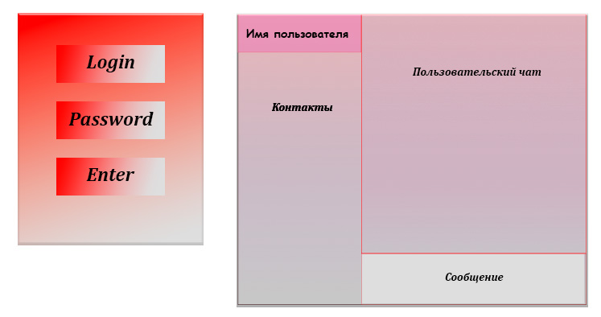
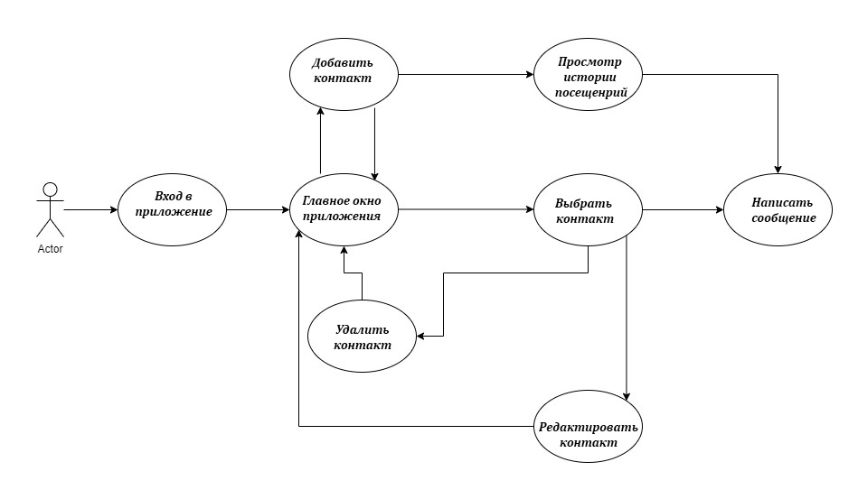
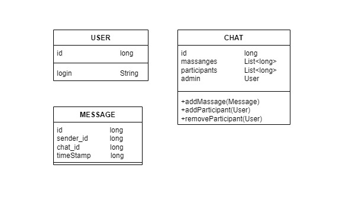
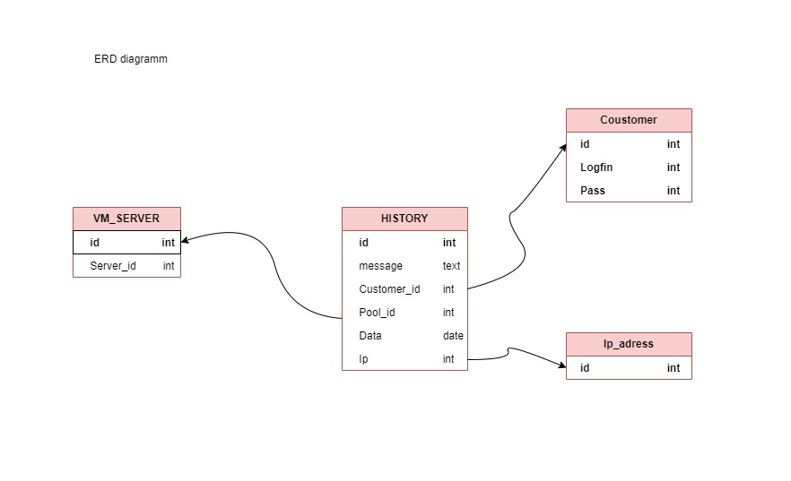

#### Урок 10. Разработать приложение мессенджера (на выбор desktop/web/mobile). Требуется написать use case диаграмму, выбрать архитектуру для приложения (кратко обосновать выбор), UML и ER диаграммы для выбранной архитектуры. Используя метод персон (не менее 3), описать каких функций не хватает. Пересмотреть UML и ER диаграммы с учетом недостатков. Создать интерфейс в figma для приложения.

---
### UI

---
### UseCase

---
### UML

---
### ERD

